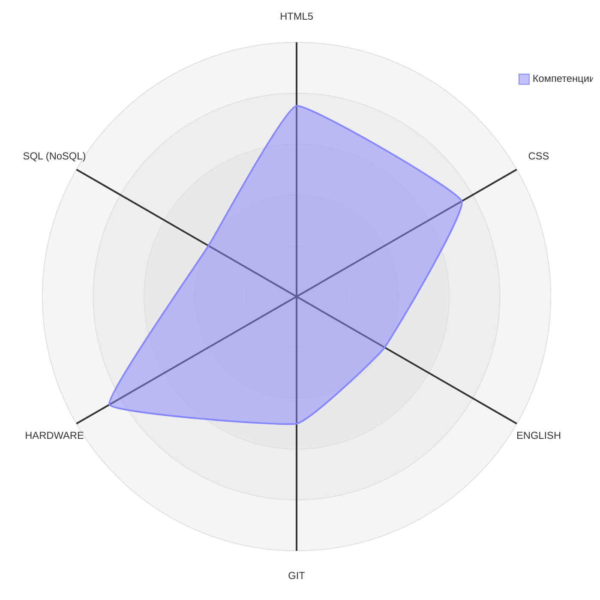

## Коротко обо мне
```Меня зовут Александр Койков.```   
```Увлекаюсь изучением технологий веб-разработки, разработки десктопных приложений, игр. ```  
```Буду рад получить обратную связь по любым вопросам.```

### Уровень образования
```В 2011 году окончил обучение в Вятском колледже управления и новых технологий```  
```по специальности Программное обеспечение вычислительной техники и автоматизированных систем.```

### Мой стек технологий 


### Обратная связь
[](https://t.me/alexkoykov)
[](mailto:alexkoykov@inbox.ru)
[](https://github.com/alexkoykov)

<!--
### Статистика на GitHub


-->
